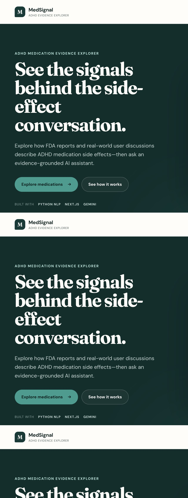
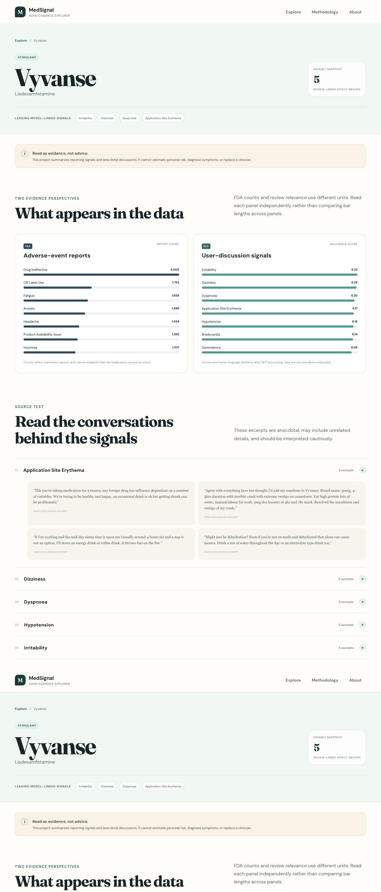

# MedSignal — ADHD Medication Evidence Explorer

[](https://website-opal-one-26.vercel.app)
[](https://nextjs.org/)
[](https://ai.google.dev/)
[](LICENSE)

MedSignal is an evidence-grounded exploration tool for ADHD medication side-effect reports. It combines interactive medication comparisons with a Gemini-powered assistant that answers from retrieved user-report excerpts and displays the supporting evidence beside each response.

**Live application:** [website-opal-one-26.vercel.app](https://website-opal-one-26.vercel.app)

> User reports are anecdotal. This project does not establish causation and is not medical advice.



## Features

- Explore side-effect signals across 12 ADHD medications.
- Review medication-specific rankings and user discussion excerpts.
- Ask natural-language questions on every medication page.
- Receive Gemini answers grounded only in retrieved evidence.
- Inspect citations and candidate NLP labels for every answer.
- Compare medication signals through a responsive Next.js interface.



## Architecture

```text
Browser
  └─ Next.js application on Vercel
       ├─ Static medication and review datasets
       ├─ Medication-aware lexical retrieval
       └─ Server-side Gemini API call
            └─ Grounded answer + cited excerpts
```

The deployed application uses a Next.js serverless API route:

1. Filter indexed reports to the selected medication.
2. Rank candidate excerpts against the user's question.
3. Send only the retrieved excerpts to Gemini.
4. Return the answer with citations and an anecdotal-evidence warning.

The repository also contains an optional Python research pipeline using BioBERT embeddings, FAISS retrieval, and FastAPI. It supports local semantic-retrieval experiments but is not required by the public Vercel application.

## Technology

- Frontend: Next.js 16, React 19, CSS
- Production RAG: Next.js API route, lexical retrieval, Google Gemini
- Research RAG: Python, BioBERT, FAISS, FastAPI
- Testing: Pytest, TypeScript, Next.js production build
- Hosting: Vercel with GitHub automatic deployments

## Run the Website Locally

Requirements: Node.js 20 or newer and pnpm.

```bash
git clone https://github.com/samantha0820/adhd-side-effect-rag.git
cd adhd-side-effect-rag/website
pnpm install
```

Create `website/.env.local`:

```bash
GEMINI_API_KEY=your-google-gemini-api-key
GEMINI_MODEL=gemini-3.6-flash
```

Start the development server:

```bash
pnpm dev
```

Open [http://localhost:3000](http://localhost:3000).

Never commit `.env`, `.env.local`, or API keys. The Gemini key is used only by the server-side API route and must not have a `NEXT_PUBLIC_` prefix.

## Run the Research RAG API

Requirements: Python 3.9 or newer and Poetry.

```bash
poetry install
cp .env.example .env
poetry run build-rag-index
poetry run uvicorn src.side_effect.rag.api:app --reload
```

The health endpoint is [http://127.0.0.1:8000/health](http://127.0.0.1:8000/health). The API intentionally has no homepage at `/`.

## Validation

Run the Python test suite from the repository root:

```bash
poetry run pytest -q
```

Validate the production website:

```bash
cd website
pnpm exec tsc --noEmit
pnpm build
pnpm audit --prod
```

Current verified status:

- 10 Python tests passing
- TypeScript validation passing
- Next.js production build passing
- No known production dependency vulnerabilities
- Production Gemini RAG returning grounded answers and citations

## Project Structure

```text
side_effect_LLM/
├── src/side_effect/
│   ├── rag/                 # Semantic research RAG service
│   └── *.py                 # NLP analysis pipeline
├── tests/                   # Python retrieval and API tests
├── website/
│   ├── components/          # Reusable React UI
│   ├── lib/data.js          # Medication data utilities
│   ├── pages/               # Pages and serverless RAG API
│   ├── public/data/         # Derived datasets used by the UI
│   └── styles/              # Application styling
├── .env.example             # Safe environment-variable template
├── pyproject.toml           # Python dependencies and tooling
└── README.md
```

## Deployment

The Vercel project is connected to this GitHub repository with `website` configured as its Root Directory. Every push to `main` automatically creates a production deployment.

`GEMINI_API_KEY` and `GEMINI_MODEL` must be configured as server-side Vercel environment variables.

## Data and Responsible Use

The displayed excerpts originate from user-generated discussions and medication reviews. Automated retrieval and candidate side-effect labels may be incomplete or incorrect. The interface therefore keeps source excerpts visible, avoids presenting retrieval scores as clinical probabilities, and instructs Gemini not to claim unsupported effects.

## License

Released under the [MIT License](LICENSE).
