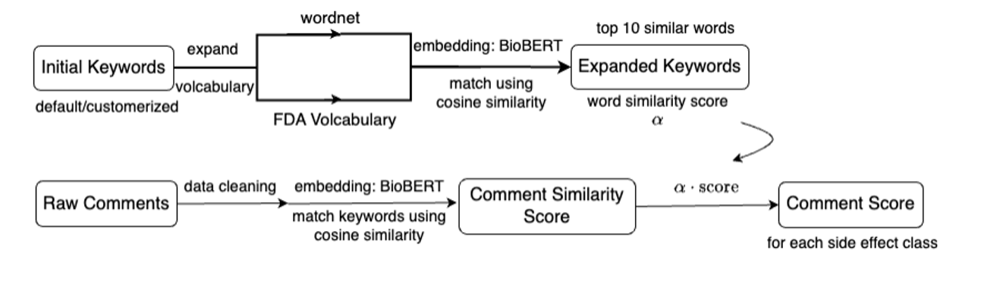
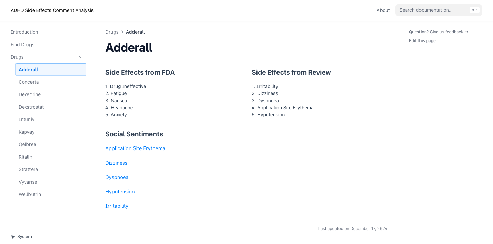
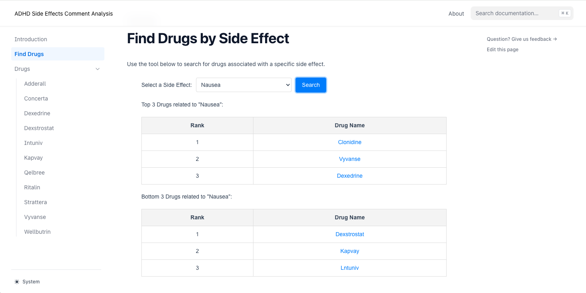

# **Side Effect Analysis Pipeline**

Live demo: [ADHD Side Effect RAG](https://website-opal-one-26.vercel.app)

## **Project Overview**

This project analyzes user reviews from **Reddit** and **Drugs.com** to identify and rank potential **side effects** of ADHD medications. Using **BioBERT embeddings**, **keyword expansion**, **sentiment analysis**, and **similarity analysis**, the system extracts, scores, and ranks drug-related side effects from user-generated content and compares them against official side effect data retrieved from openFDA.

The pipeline combines **Natural Language Processing (NLP)** and **machine learning** techniques to:

1. Preprocess and clean raw review data.
2. Expand official side effect keywords with **WordNet** and **BioBERT**.
3. Perform **sentiment analysis** to focus on negative user experiences.
4. Calculate similarity between user comments and expanded side effect keywords.
5. Rank side effects for each drug and extract relevant user comments.

---

## **Usage**

If you haven't had your poetry setup, please following the step in **Installation Package** part below.

1. **Prepare Input Data**:

   - Place raw Reddit and Drugs.com review data in the `data` directory.

2. **Run the Pipeline**:
   Execute the `apply.py` script to clean, process, and analyze the reviews:

   ```bash
   poetry run python src/side_effect/apply.py
   ```

   Optional Command-Line Arguments:

   - `--process_data`: Preprocess input data before running the analysis.
   - `--drug`: Specify a list of drugs to analyze.
   - `--side_effect`: Specify side effects to focus the analysis on.

   ```bash
   poetry run python src/side_effect/apply.py --process_data
   ```

   Analyze specific drugs and side effects:

   ```bash
   poetry run python src/side_effect/apply.py -d Adderall,Ritalin -se Insomnia,Nausea
   ```

3. **Output Files**:
   - `output/side_effect_scores.csv` contains ranked side effects.

Example Output for side_effect_scores.csv

| Drug Name | Side Effect | Score |
| --------- | ----------- | ----- |
| Adderall  | Insomnia    | 5.573 |
| Adderall  | Nausea      | 4.752 |
| Adderall  | Headache    | 4.749 |

- `output/top_k_comments.csv` lists the most relevant user comments.

Example Output for top_k_comments.csv

| Drug Name | Side Effect | Comment                                      | Score |
| --------- | ----------- | -------------------------------------------- | ----- |
| Adderall  | Insomnia    | "I couldn't sleep at all after taking this." | 5.573 |
| Vyvanse   | Nausea      | "This drug made me feel nauseous all day."   | 4.752 |
| Ritalin   | Headache    | "I developed a severe headache after use."   | 4.749 |

- `output/{drug}_rank.csv` provides drug-specific side effect rankings.

Example Output for {drug}\_rank.csv

| rank  | Side Effect | Comment                                      |
| ----- | ----------- | -------------------------------------------- |
| top1  | Insomnia    | "I couldn't sleep at all after taking this." |
| top2  | Nausea      | "This drug made me feel nauseous all day."   |
| tail1 | Headache    | "I developed a severe headache after use."   |
| tail2 | Pain        | "I developed a severe headache after use."   |

---

## **Key Features**

1. **Data Collection and Cleaning**:

   - Reviews from **Reddit** and **Drugs.com** are preprocessed, cleaned, and stored in structured CSV files.
   <!-- - `side_effect.py` and `data_processing.py` handles **Drugs.com** reviews.
   - `data_processing_reddit.py` processes **Reddit** reviews. -->

2. **Sentiment Analysis**:

   - Negative comments are extracted using **VADER Sentiment Analyzer** (from NLTK).
   - Positive comments are removed to focus on reviews indicating adverse experiences.

3. **Keyword Expansion**:

   - Official side effect keywords are expanded using **WordNet synonyms** and **BioBERT embeddings**.
   - Enhances coverage and accuracy of side effect detection.

4. **Similarity Analysis**:

   - Computes **cosine similarity** between expanded keywords and user comment embeddings using BioBERT.
   - Identifies comments closely associated with specific side effects.

5. **Ranking and Scoring**:

   - Side effects are ranked based on their relevance scores.
   - Top K comments for each drug and side effect are extracted for analysis.

6. **Outputs**:
   - Cleaned and processed comments.
   - Ranked side effects and their relevance scores.
   - Comments most relevant to identified side effects.

---

## **Main Content in Project Directory Structure**

```bash
├── data
│   ├── cleaned_reddit           # Cleaned Reddit review data
│   ├── raw_reddit               # Raw Reddit data
│   ├── simulants_reviews.csv    # Drugs.com simulants reviews
│   ├── non_simulants_reviews.csv # Drugs.com non-simulants reviews
│   └── side_effects.csv         # Official side effects (OpenFDA)
│
├── src
│   └── side_effect
│       ├── data_processing.py       # Processes entire data sets to obtain data with proper structure and contents
│       ├── data_processing_reddit.py # Processes Reddit reviews
│       ├── embedding_and_keywords.py # BioBERT and WordNet for keyword expansion
│       ├── analysis.py              # Similarity and ranking analysis
│       └── side_effect.py           # Core utilities for cleaning & filtering (including sentiment analysis and selecting comments with certain limitation)
│       └── apply.py                # Main script:runs the entire pipeline
│
├── output
│   ├── side_effect_scores.csv     # Ranked side effects with scores
│   ├── top_k_comments.csv         # Top K comments related to side effects
│   └── new_comment_dict.csv       # Processed comments with side effect matches
│
├── website                        # Front-end components for visualization
│   ├── components                 # React components
│   └── pages                      # Webpages for each drug
│
├── README.md                      # Documentation (you are here)
├── LICENSE                        # Project license
└── pyproject.toml
```

---

## **Pipeline Diagram**

Below is the high-level architecture of the side effect analysis pipeline:

The process of determining the most relevant comments for a given side effect is as follows:



The process for determining the number of most relevant comments and subsequently calculating the relevance score between the input drug and side effect is as follows:


## **Installation Package**

1. **Clone the Repository**

   First, clone the repository using Git:

   ```bash
   git clone https://github.com/xinzhouli00/side_effect.git
   cd side_effect
   ```

2. **Install Dependencies**

   Within the cloned directory, run the following command to install the project dependencies with Poetry:

   ```bash
   poetry install
   ```

   This command will create a virtual environment and install all the dependencies specified in the pyproject.toml file.

3. **Activate the Virtual Environment**

   ```bash
   poetry shell
   ```

4. **Updating Dependencies**

   To update the dependencies to their latest compatible versions, run:

   ```bash
   poetry update
   ```

---

## **Test**

Run tests using:

```bash
pytest -v tests
```

## **RAG Question Answering**

The project has two intentionally separate retrieval paths:

- The public Vercel demo uses a Next.js serverless route. It filters reports by
  medication, ranks candidate excerpts lexically, and sends only those excerpts
  to Google Gemini.
- The local research pipeline uses BioBERT embeddings and FAISS behind a FastAPI
  service. This path supports semantic retrieval and reproducible offline
  experiments, but is not part of the current Vercel runtime.

The default generation model is `gemini-3.6-flash`; override it with
`GEMINI_MODEL`.

### Run the public website locally

```bash
cd website
pnpm install
GEMINI_API_KEY="your-api-key" pnpm dev
```

Open `http://localhost:3000`. The API key remains server-side in the Next.js API
route and must never use a `NEXT_PUBLIC_` prefix.

### Run the semantic research pipeline locally

1. Install the updated dependencies and configure the server environment:

   ```bash
   poetry install
   cp .env.example .env
   export GEMINI_API_KEY="your-api-key"
   ```

2. Build the local vector index. Use the raw reviews CSV when it is available
   so source metadata can be retained; otherwise the checked-in derived JSON is
   used by default:

   ```bash
   poetry run build-rag-index
   poetry run build-rag-index --input data/reviews.csv
   ```

3. Start the Python API:

   ```bash
   poetry run uvicorn src.side_effect.rag.api:app --reload
   ```

The FastAPI health endpoint is `http://127.0.0.1:8000/health`. A `404` response
at `/` is expected because the Python service exposes an API, not a homepage.

Each medicine page includes a question box. Responses include the retrieved
review excerpts and an explicit warning that user reports are anecdotal and not
medical advice.

### Vercel deployment

The live portfolio site is deployed from the `website` directory. Configure
`GEMINI_API_KEY` as a Vercel server-side environment variable, then deploy:

```bash
cd website
pnpm dlx vercel@latest --prod
```

For automatic deployments, connect the project to your own GitHub repository
and set the Vercel root directory to `website`.

### Optional full-stack Docker deployment

The production image runs Next.js, FastAPI, and Nginx in one container. It also
builds the BioBERT/FAISS index during the image build, so no persistent disk is
required for the read-only demo.

Build and run locally:

```bash
docker build -t side-effect-rag .
docker run --rm -p 7860:7860 \
  -e GEMINI_API_KEY="your-api-key" \
  side-effect-rag
```

Open `http://localhost:7860` and verify
`http://localhost:7860/health` returns `{"status":"ok"}`.

The same image can optionally be deployed to Google Cloud Run. This is not the
hosting path used by the current public demo. Store the Gemini key in Google
Secret Manager and inject it only into the FastAPI process at runtime.

Build and deploy a new revision:

```bash
gcloud builds submit \
  --project=side-effect-rag \
  --tag=us-central1-docker.pkg.dev/side-effect-rag/side-effect-rag/app:latest

gcloud run deploy side-effect-rag \
  --project=side-effect-rag \
  --region=us-central1 \
  --image=us-central1-docker.pkg.dev/side-effect-rag/side-effect-rag/app:latest \
  --port=7860 \
  --cpu=2 \
  --memory=4Gi \
  --min-instances=0 \
  --max-instances=1 \
  --concurrency=4 \
  --timeout=300 \
  --no-cpu-throttling \
  --set-env-vars=GEMINI_MODEL=gemini-3.6-flash \
  --set-secrets=GEMINI_API_KEY=gemini-api-key:1 \
  --allow-unauthenticated
```

`--no-cpu-throttling` is required by the current single-container architecture
because Nginx, Next.js, and FastAPI run as supervised processes. Minimum
instances remains zero, so the service still scales down when it is unused.

Hugging Face Docker Spaces can also run the same image when the account has a
plan that supports Docker Spaces. Add `GEMINI_API_KEY` under **Settings →
Secrets** and never commit `.env` or an API key to the Space repository.

Or use the guarded deployment script, which excludes local data, build outputs,
dependencies, and `.env`, then copies the Gemini key directly to Space Secrets:

```bash
poetry run huggingface-cli login
poetry run python scripts/deploy_hf_space.py --space-name adhd-side-effect-rag
```

---

## **Demostration Website**

Our project processes three key data sources and converts them into JSON format for website visualization:

1. **User Reviews Analysis (`reviews.json`)**
2. **Side Effect Scores (`drugSideEffectsData.json`)**
3. **FDA Report Analysis (`formatted_drug_reactions.json`)**

Our `merge_data_json.py` script handles the conversion of CSV files to JSON format and their placement in the website directory:

```bash
project/
├── merge_data_json.py      # Data conversion script
├── output/                 # Processed CSV files
│   ├── side_effect_scores.csv
│   ├── drug_reactions.csv
│   └── merged_drug_data.csv
└── website/
    └── public/
        └── data/           # JSON files for website
            ├── reviews.json
            ├── drugSideEffectsData.json
            └── formatted_drug_reactions.json
```

### Processing Steps:

1. Script reads CSV files from `output/` directory
2. Converts data to appropriate JSON format
3. Automatically saves files to `website/public/data/`
4. Files become accessible to website components

### File Mapping:

- `side_effect_scores.csv` → `drugSideEffectsData.json`
- `drug_reactions.csv` → `formatted_drug_reactions.json`
- `merged_drug_data.csv` → `reviews.json`

These JSON files are placed in the `website/public/data/` directory and are utilized by the website for:

- Interactive visualizations
- Drug comparison features
- Side effect frequency analysis
- User experience insights

To run the website:

```bash
pnpm i        # Install dependencies
pnpm dev      # Start development server
```

Then visit localhost:3000 to view the interactive dashboard.

### How to Use Our ADHD Medication Side Effect Analysis Tool

Our website provides two main features to help users understand and compare ADHD medication side effects:

#### Individual Drug Pages


Each medication has a dedicated page showing:

1. **Side Effects Comparison**

- FDA-reported side effects ranking
- User review-based side effects ranking
- Allows users to compare official data with real user experiences

2. **Social Sentiments**

- Actual user comments and experiences
- Provides real-world context for side effects

#### Find Drugs by Side Effect Feature


This tool helps users make informed decisions about medication choices:

1. **Search Function**

- Select a specific side effect from dropdown menu
- Click "Search" to view results

2. **Results Display**

- Shows Top 3 drugs with strongest association to the selected side effect
- Shows Bottom 3 drugs with weakest association
- Helps users identify medications that might minimize specific side effects

3. **Interactive Navigation**

- Click on any drug name to view its detailed page
- Allows users to learn more about medications with promising profiles

This tool is particularly useful for:

- Users concerned about specific side effects
- Healthcare providers discussing medication options
- Anyone seeking to understand ADHD medication trade-offs

---

## **Future Plans**

1. **Model Optimization**:

   - Improve the performance of similarity scoring and ranking algorithms to enhance accuracy.

2. **Vocabulary Expansion**:

   - Include more diverse and comprehensive terms in the keyword expansion process to improve coverage of side effect detection.

3. **Audience Segmentation**:

   - Segment users into different groups to gain a more nuanced understanding of feedback and side effect patterns.

4. **Advanced Similarity Matching**:

   - Experiment with various similarity measures to determine the most effective method for matching and analyzing textual data.

5. **Frontend-Backend Integration**:
   - Develop robust interfaces for seamless updates to the data pipeline and ensure the results are dynamically reflected in the front-end visualization.

---

## **Team Members**

- **Siyu Hu**
- **Xinzhou Li**
- **Qingyang Wang**
- **Shengmian Wang**

---

## **License**

This project is licensed under the MIT License. See the [LICENSE](LICENSE) file for details.

---

## **Acknowledgments**

- BioBERT model: [DMIS Lab](https://huggingface.co/dmis-lab/biobert-base-cased-v1.2)
- OpenFDA: Source for official side effects data. [OpenFDA](https://open.fda.gov/)
- NLTK WordNet: For keyword expansion.
- VADER Sentiment Analyzer: For sentiment filtering.

---

This README provides a comprehensive overview of the project, including its objectives, structure, installation, usage, and outputs.
